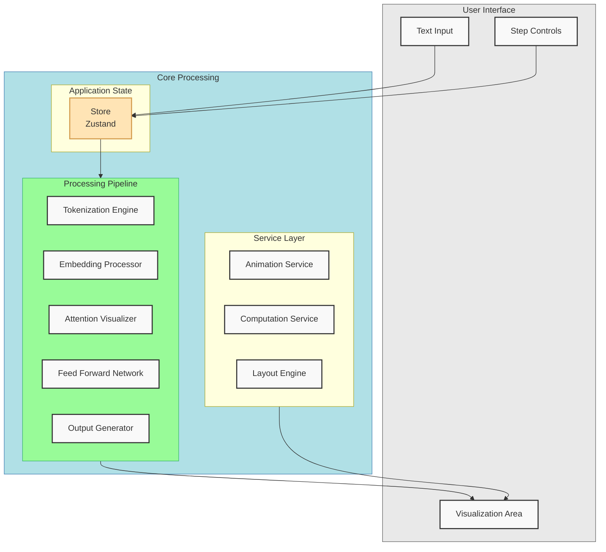

# Interactive LLM Processing Visualizer

Production-grade React application for visualizing Large Language Model text processing pipelines. Built with modern frontend architecture using React, Vite, and shadcn/ui components for real-time interactive demonstrations of LLM internals.

<div align="center">
  <video width="100%" max-width="800px" src="https://github.com/user-attachments/assets/7865a575-ef2e-45be-8eb6-68b3c5a5f96b"></video>
</div>

## Architecture



### Key Components

- **User Interface Layer**: React components using shadcn/ui
- **State Management**: Zustand store with middleware
- **Processing Pipeline**: Modular visualization processors
- **Service Layer**: Animation and computation services

### Technical Stack

- **Frontend Framework**: React 18 with Vite
- **UI Components**: shadcn/ui with Tailwind CSS
- **State Management**: Zustand
- **Animation**: Framer Motion
- **Icons**: Lucide React
- **Testing**: Vitest and Testing Library
- **Performance**: React Suspense and lazy loading

## Prerequisites

- Node.js 18.0+
- npm 8.0+
- Modern browser with WebGL support

## Development Setup

1. **Clone Repository**

```bash
git clone https://github.com/organization/llm-visualizer
cd llm-visualizer
```

2. **Install Dependencies**

```bash
# Install project dependencies
npm install

# Install required shadcn/ui components
npm run shadcn:add button card input slider toast alert dialog

# Setup development environment
cp .env.example .env.local
```

3. **Configure Environment**

```env
VITE_APP_VERSION=1.0.0
VITE_ENABLE_DEBUG=false
VITE_ANIMATION_SPEED=1
VITE_MAX_INPUT_LENGTH=1000
```

4. **Start Development Server**

```bash
npm run dev
```

## Project Structure

```
├── src/
│   ├── components/
│   │   ├── ui/             # shadcn/ui components
│   │   ├── visualization/  # LLM visualization components
│   │   └── layout/        # Layout components
│   ├── hooks/
│   │   ├── useProcessor.ts
│   │   └── useAnimation.ts
│   ├── services/
│   │   ├── tokenizer.ts
│   │   ├── embedding.ts
│   │   └── attention.ts
│   ├── store/
│   │   └── index.ts
│   └── utils/
│       ├── constants.ts
│       └── helpers.ts
├── tests/
│   ├── unit/
│   └── integration/
└── public/
```

## Testing

```bash
# Run unit tests
npm run test:unit

# Run integration tests
npm run test:integration

# Run all tests with coverage
npm run test:coverage
```

## Performance Optimization

- Dynamic imports for visualization modules
- Memoization of expensive computations
- WebGL acceleration for matrix operations
- Debounced user input handling
- Virtual scrolling for large datasets

## Browser Support

- Chrome/Edge 90+
- Firefox 90+
- Safari 14+

## Error Handling

The application implements comprehensive error boundaries and fallbacks:
- Input validation errors
- Processing pipeline failures
- Animation engine errors
- Resource loading issues

## Monitoring and Analytics

- Performance metrics collection
- User interaction tracking
- Error reporting
- Usage analytics

## Contributing

1. Fork the repository
2. Create a feature branch
3. Implement changes with tests
4. Submit pull request

### Development Guidelines

- Follow conventional commits
- Add tests for new features
- Update documentation
- Maintain type safety
- Follow ESLint configuration

## Build and Deployment

```bash
# Production build
npm run build

# Preview production build
npm run preview

# Type check
npm run type-check

# Lint
npm run lint
```

## Security

- Input sanitization
- XSS prevention
- CSP configuration
- Regular dependency audits

## License

MIT License

---

*For questions and support, please open an issue in the repository.*
